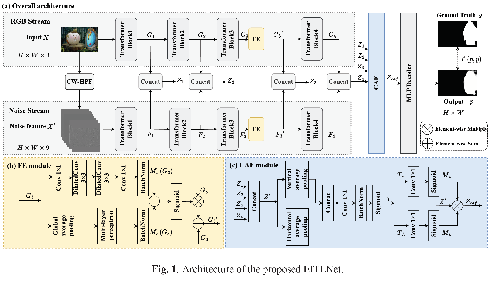
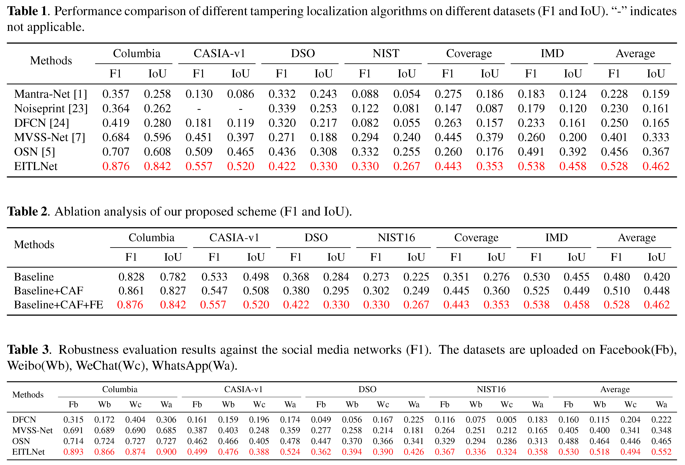

## EFFECTIVE IMAGE TAMPERING LOCALIZATION VIA ENHANCED TRANSFORMER AND CO-ATTENTION FUSION 
An official implementation code for paper "[Effective Image Tampering Localization via Enhanced Transformer and Co-attention Fusion](https://arxiv.org/pdf/2309.09306)". This repo provide codes, pretrained/trained weights, and our training datasets.

### Network Architecture


### Update
- 24.05.18. We upload the training dataset.
- 24.04.26. We updated the weight which can be downloaded from [Google Drive Link](https://drive.google.com/file/d/1fr0PLfTs0l4aPERFUizAdXKPW1cOg05H/view?usp=drive_link) or [Baiduyun Link](https://pan.baidu.com/s/1ltB8YJO2szg6aXI-IpSOqg)  (password：EITL) and the file `nets/EITLnet.py`. The latest corrected experimental results are marked in <font color=Red>red</font> in the table below, which the average performance is more higher than before([paper](https://ieeexplore.ieee.org/abstract/document/10446332)).



### Environment

- Python 3.8
- cuda11.1+cudnn8.0.4

### Requirements

- `pip install -r requirements.txt`

### Training dataset

The training dataset catalog is as follows.

```
├─train_dataset
    ├─ImageSets
    │  └─Segmentation
    │          train.txt
    │          val.txt
    ├─JPEGImages
    │      00001.jpg
    │      00002.jpg
    │      00003.jpg     
    │      ...
    └─SegmentationClass
            00001_gt.png
            00002_gt.png
            00003_gt.png
```
Please download the training dataset from [Kaggle Link](https://www.kaggle.com/datasets/sphiaguo/eitlnet-train-datasets) or [Baiduyun Link](https://pan.baidu.com/s/15exiPJ7eux1HnK4DNIJYSg)(password:EITL).
The SegmentationClass0255 folder contains ground truth values of only 0 and 255, while the SegmentationClass01 folder contains values of only 0 and 1. In this paper, the latter folder was used for training. The SegmentationClass01 folder was generated from the former using the `to01.py` script.

### Trained Models
Please download the weight from [Google Drive Link](https://drive.google.com/file/d/1fr0PLfTs0l4aPERFUizAdXKPW1cOg05H/view?usp=drive_link) or [Baiduyun Link](https://pan.baidu.com/s/1ltB8YJO2szg6aXI-IpSOqg)(password:EITL) and place it in the `weights/` directory.

### Training
```python
python train.py
```

### Testing

```
python test.py
```

## Bibtex
 ```
@inproceedings{guo2023effective,
  title={Effective Image Tampering Localization via Enhanced Transformer and Co-attention Fusion},
  author={Guo, Kun and Zhu, Haochen and Cao, Gang},
  booktitle={ICASSP},
  year={2024}
}
 ```
### Contact

If you have any questions, please ask in the [issue](https://github.com/multimediaFor/EITLNet/issues).
